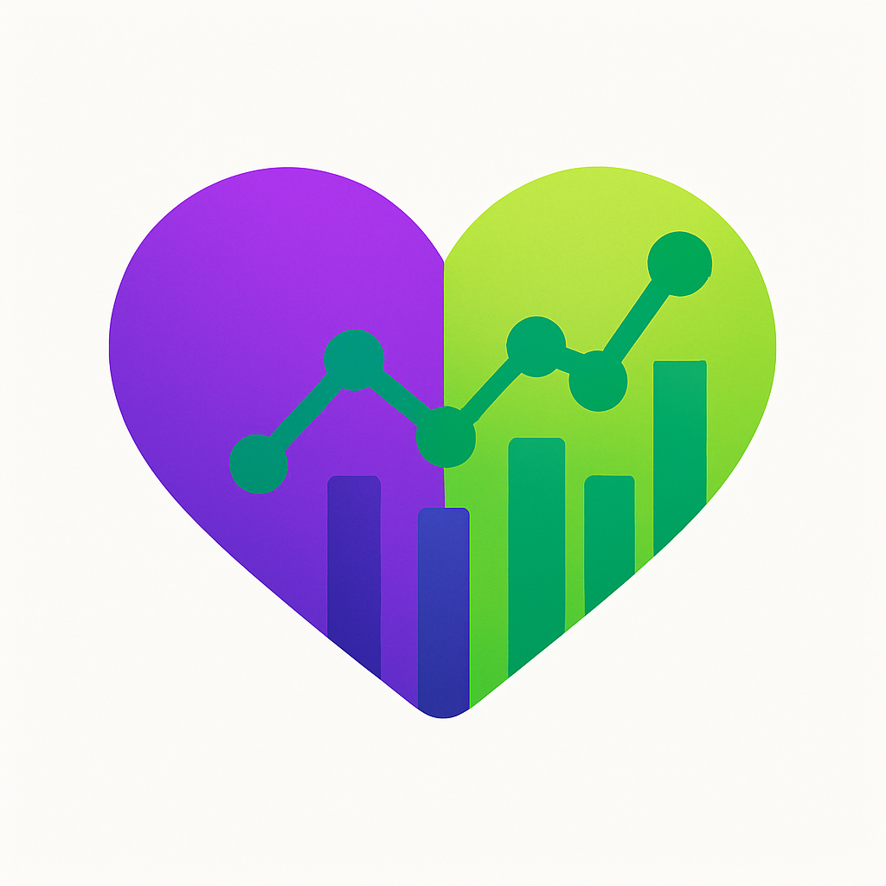

<!-- Logo -->
<p align="center">
  
</p>

<h1 align="center">🏋️‍♀️ FitnessAnalyticsHubV1_0</h1>
<p align="center">
  Ein wachsendes Analyse- und Lernprojekt rund um Fitness, Trainingsdaten und moderne .NET-Technologien.
</p>

---

## 🚀 Projektziele

Dieses Projekt ist eine persönliche Spielwiese für moderne Softwareentwicklung mit Fokus auf:

- 🧱 Clean Architecture mit Domain, Application, Infrastructure
- 🖥️ Moderne UI mit Angular & evtl. auch noch WPF
- 🧪 Architekturtests mit NetArchTest
- 🐳 Dockerisierung & Bereitstellung
- 🤖 Automatisierung durch GitHub Actions
- 🔄 Datenintegration mit externen Services (Strava API)

---

## 🔬 Code Quality & Security

[](https://sonarcloud.io/summary/new_code?id=lady-logic_FitnessAnalyticsHubV1_0)

Dieses Projekt verwendet **SonarCloud** für kontinuierliche Code-Qualitätsüberwachung:
- 🛡️ **Security Vulnerabilities** - Automatische Sicherheitsprüfung
- 🐛 **Bug Detection** - Potentielle Fehler werden erkannt
- 📊 **Code Coverage** - Test-Abdeckung wird gemessen
- 🧹 **Code Smells** - Wartbarkeit wird bewertet
- 📈 **Technical Debt** - Refactoring-Bedarf wird geschätzt

[**→ Live SonarCloud Dashboard ansehen**](https://sonarcloud.io/project/overview?id=lady-logic_FitnessAnalyticsHubV1_0)

---

## 🧱 Architekturüberblick

```text
📦 FitnessAnalyticsHubV1_0
├── 01_Core
│   └── 🧠 FitnessAnalyticsHub.Domain            // Entitäten, Value Objects, Interfaces
│
├── 02_Application
│   └── 🧰 FitnessAnalyticsHub.Application       // Services, DTOs, Interfaces
│
├── 03_Infrastructure
│   └── 🏗️ FitnessAnalyticsHub.Infrastructure    // Repositories, externe APIs, Persistence
│
├── 04_UI
│   ├── 🖼️ FitnessAnalyticsHub.UI.WPF            // Desktop-Client mit MVVM (enthält noch einige offene Baustellen...)
│   ├── 🌐 FitnessAnalyticsHub.WebApi            // RESTful API für Clients
│   └── 🌐 UI.Angular                            // Web-Frontend (erste Oberfläche für Athlet 😀)
│
├── 05_Tests
│   └── 🧪 FitnessAnalyticsHub.Tests             // Architekturtests und Unit-Tests
│
└── 06_AIAssistant
    └── 🤖 FitnessAnalyticsHub.AIAssistant       // KI-Integration (rudimentäre Implementierung)
```

---

## 🧪 Aktueller Fortschritt

| Thema | Status | Beschreibung |
|---|---|---|
| Clean Architecture | ✅ Basis steht | Projektstruktur aufgebaut |
| **CI/CD Pipeline** | ✅ **Produktiv** | **GitHub Actions mit SonarCloud Integration** |
| **Code Quality** | ✅ **Produktiv** | **SonarCloud Monitoring & Branch Protection** |
| Unit Tests | ✅ **Produktiv** | xUnit + FluentAssertions |
| Architekturtests | ✅ **Produktiv** | NetArchTest für Strukturvalidierung |
| **Code Coverage** | ✅ **Produktiv** | **Automatische Messung & Reporting** |
| WPF UI | 🚧 In Arbeit | Desktop-Anwendung mit Charts |
| Angular UI | 🚧 In Arbeit | Web-Oberfläche mit responsivem Design |
| Strava API | 🚧 In Arbeit | Abruf von Trainingsdaten |
| Docker | 📝 ToDo | Deployment-Vorbereitung |
| CQRS | 📝 ToDo | Implementierung von Command/Query Separation |

---

## 🧪 Test Status

- ✅ **Unit Tests**: Controller und Service Layer mit umfassenden Tests
- 🏛️ **Architecture Tests**: Clean Architecture Compliance mit NetArchTest
- 📊 **Code Coverage**: Automatisch gesammelt und in SonarCloud visualisiert
- 🔄 **Automatische Ausführung**: Bei jedem Commit via GitHub Actions

---

## 🛠️ Technologie Stack & DevOps

**Backend & Framework:**
- 🧠 [.NET 8](https://dotnet.microsoft.com/) (Latest LTS)
- 🔄 [Entity Framework Core](https://docs.microsoft.com/ef/core/) mit SQLite
- 🧱 Clean Architecture Pattern

**Frontend & UI:**
- 🖼️ [WPF](https://learn.microsoft.com/en-us/dotnet/desktop/wpf/) mit MVVM Pattern
- 🌐 [Angular](https://angular.io/) für moderne Web-UI

**Code Quality & Testing:**
- 🧪 [xUnit Testing Framework](https://xunit.net/) mit umfassenden Unit Tests
- 🧪 [FluentAssertions](https://fluentassertions.com/) für aussagekräftige Test-Assertions
- 🏛️ [NetArchTest](https://github.com/BenMorris/NetArchTest) für Architecture Tests
- 🔬 **SonarCloud Integration** für kontinuierliche Code-Qualitätsüberwachung
- 📊 Code Coverage Tracking und Reporting

**DevOps & CI/CD:**
- 🤖 **GitHub Actions** - Vollautomatisierte CI/CD Pipeline
- ✅ Automatisierte Tests bei jedem Commit
- 🛡️ **Branch Protection Rules** - Code Review Workflow enforced
- 🔄 **Multi-Stage Pipeline**: Build → Test → Code Quality Analysis
- 📦 Artifact Management für Test-Reports und Coverage-Daten

**Integration & APIs:**
- 🔗 [Strava API](https://developers.strava.com/) für Fitness-Datenintegration
- 🤖 AI Assistant Integration (in Entwicklung)

**Entwicklungsstandards:**
- 📋 Git Workflow mit Feature Branches
- 💬 Semantic Commit Messages
- 📖 Comprehensive Documentation
- 🏆 Professional README mit Quality Badges

---

## 📋 Getting Started

### Voraussetzungen
- .NET 8.0 SDK
- Visual Studio 2022 oder VS Code

### Installation
```bash
git clone https://github.com/lady-logic/FitnessAnalyticsHubV1_0.git
cd FitnessAnalyticsHubV1_0
dotnet restore
dotnet build
```

### Tests ausführen
```bash
# Alle Tests
dotnet test

# Nur Unit Tests
dotnet test --filter "Category!=Architecture"

# Nur Architecture Tests
dotnet test --filter "Category=Architecture"

# Mit Coverage
dotnet test --collect:"XPlat Code Coverage"
```

### API starten
```bash
cd FitnessAnalyticsHub.WebApi
dotnet run
```

Die API ist dann verfügbar unter: `https://localhost:7001`

---

## 🔗 Strava API Integration

Die Integration mit der Strava API ermöglicht den Zugriff auf:
- Aktivitätsdaten (Laufen, Radfahren, etc.)
- Leistungsmetriken
- Strecken und Routen
- Benutzerprofildaten

---

## 🤖 AIAssistant-Modul

Das FitnessAnalyticsHub.AIAssistant-Modul ist derzeit nur rudimentär implementiert und noch nicht mit dem Hauptprojekt verbunden. Zukünftig soll es folgende Funktionen bieten:
- **Trainingsanalyse**: Auswertung von Leistungsdaten
- **Prognosen**: Vorhersage von Leistungsentwicklungen
- **Motivationscoaching**: Personalisierte Trainingstipps

---

## 🎯 Roadmap

- ✅ GitHub CI/CD Workflows integrieren
- ✅ Code Quality Monitoring mit SonarCloud
- ✅ Tests + Testabdeckung ausbauen
- 🚧 Trainingsdaten via Strava API laden
- 📝 Dockerisieren für lokale + Cloud-Deployments
- 📝 CQRS-Pattern implementieren für bessere Trennung von Lese- und Schreiboperationen
- 📝 Fehlende Oberflächen in Angular ergänzen
- 📝 AIAssistant anbinden...uvm 😅

---

## 📄 License

Dieses Projekt steht unter der MIT License - siehe [LICENSE](LICENSE) Datei für Details.
