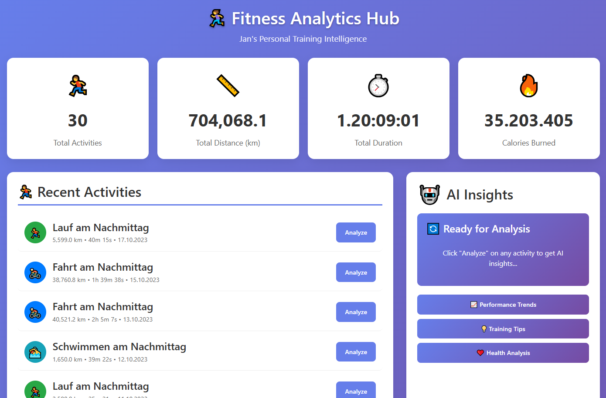
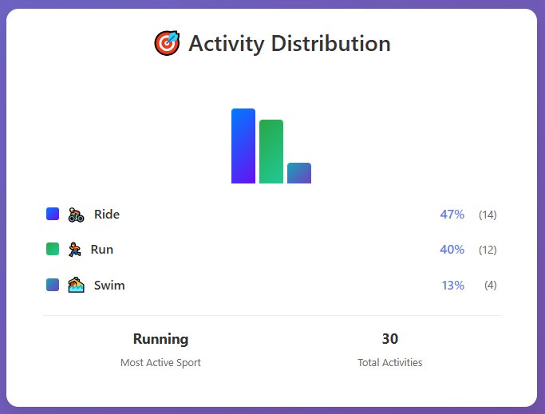

<!-- Logo -->
<p align="center">
  
</p>

<h1 align="center">🏋️‍♀️ FitnessAnalyticsHub</h1>
<p align="center">
  Ein wachsendes Analyse- und Lernprojekt rund um Fitness, Trainingsdaten und moderne .NET-Technologien.
</p>

---

## 🎯 Projektziele & Roadmap

Dieses Projekt ist eine persönliche Spielwiese für moderne Softwareentwicklung mit Fokus auf:

### 🏗️ Architektur & Design
- **Clean Architecture** mit Domain, Application, Infrastructure Layering
- **Domain-Driven Design** Prinzipien für fachliche Modellierung
- **Microservices-Architektur** mit Multi-Protocol Communication
- **Event-Driven Architecture** mit RabbitMQ für lose gekoppelte Services

### 🔄 Multi-Protocol Communication
- **HTTP/REST** für Standard-API-Integration
- **Native gRPC** für High-Performance Service-to-Service Communication  
- **gRPC-JSON Bridge** als Best-of-Both-Worlds Lösung
- **Message Queuing** mit RabbitMQ für asynchrone Verarbeitung

### 🤖 KI & Moderne Technologien
- **AI-Integration** mit HuggingFace und Google Gemini für intelligente Trainingsanalyse
- **Angular Frontend** mit modernen UI-Patterns
- **Real-time Health Monitoring** mit umfassendem Dashboard

### 🧪 Code Quality & Testing
- **Architecture Tests** mit NetArchTest für Clean Architecture Compliance
- **Modularity Maturity Index** Berechnung für nachhaltige Codequalität
- **Continuous Code Quality** mit SonarCloud Integration
- **Comprehensive Testing** mit Unit-, Integration- und Architecture Tests

### 📋 Roadmap

**✅ Aktuell umgesetzt:**
- Clean Architecture mit strikter Dependency Inversion
- Multi-Protocol Communication (HTTP, gRPC, gRPC-JSON)
- AI-Integration mit HuggingFace + Google Gemini
- Strava API Integration mit automatischem Activity Import
- Health Monitoring Dashboard mit Auto-Refresh
- Comprehensive Error Handling mit custom Exception Hierarchy
- Docker Multi-Service Setup

**📋 Geplant:**
- Event-Driven Architecture mit RabbitMQ
- CQRS-Pattern für bessere Read/Write-Trennung
- Modularity Maturity Index Integration
- Erweiterte Microservices mit Domain Events

---

## 🎯 Dashboard Overview




---

## 🔬 Code Quality & Security

[](https://sonarcloud.io/summary/new_code?id=lady-logic_FitnessAnalyticsHubV1_0)

Dieses Projekt verwendet **SonarCloud** für kontinuierliche Code-Qualitätsüberwachung:
- 🛡️ **Security Vulnerabilities** - Automatische Sicherheitsprüfung
- 🐛 **Bug Detection** - Potentielle Fehler werden erkannt
- 📊 **Code Coverage** - Test-Abdeckung wird gemessen
- 🧹 **Code Smells** - Wartbarkeit wird bewertet
- 📈 **Technical Debt** - Refactoring-Bedarf wird geschätzt

[**→ Live SonarCloud Dashboard ansehen**](https://sonarcloud.io/project/overview?id=lady-logic_FitnessAnalyticsHubV1_0)

---
## 🏗️ Architektur

### Clean Architecture mit Microservices

```text
🌐 WebAPI (Port 5000)          🤖 AIAssistant (Port 7276)
├── Controllers                 ├── gRPC Services
├── Application Services        ├── HuggingFace Integration
├── Domain Logic               ├── Google Gemini Integration
└── Infrastructure             └── Multi-Protocol Endpoints
    ├── Strava API                 ├── HTTP/REST
    ├── Database (SQLite)          ├── Native gRPC
    └── Health Monitoring          └── gRPC-JSON Bridge
```

### Multi-Protocol Communication
```text
Frontend → WebAPI → AIAssistant
              ↓ (konfigurierbar)
              ├── HTTP/JSON ────→ REST API
              ├── gRPC ─────────→ Native gRPC
              └── gRPC-JSON ────→ JSON Bridge
```

### Geplante Erweiterungen
- **Event-Driven Architecture** mit RabbitMQ
- **Domain Events** für lose gekoppelte Services
- **CQRS Pattern** für Read/Write-Trennung

---
## ✨ Features

- 🏃‍♂️ **Strava Integration** - Automatischer Activity Import und Performance-Tracking
- 🤖 **AI-Powered Analytics** - HuggingFace + Google Gemini für intelligente Trainingsanalyse  
- 🔄 **Multi-Protocol API** - HTTP/REST, gRPC und gRPC-JSON Bridge
- 📊 **Training Plans** - Strukturierte Planung mit Fortschrittstracking
- 🏥 **Health Monitoring** - Live-Dashboard mit automatischem Service-Monitoring
- 🛡️ **Enterprise Error Handling** - Konsistente Exception-Management
- 🧪 **Architecture Testing** - Automatische Clean Architecture Compliance
---
## 🔄 Multi-Protocol Communication

Drei Kommunikationsprotokolle für flexible Microservice-Integration:

```bash
# HTTP/REST - Standard & Browser-kompatibel
POST http://localhost:7276/api/MotivationCoach/motivate

# Native gRPC - High Performance
grpc://localhost:7276/MotivationService/GetMotivation

# gRPC-JSON Bridge - Best of Both Worlds  
POST http://localhost:7276/grpc-json/MotivationService/GetMotivation
```

### Konfiguration
```json
{
  "AIAssistant": {
    "ClientType": "GrpcJson",    // "Http" | "Grpc" | "GrpcJson"
    "BaseUrl": "https://localhost:7276"
  }
}
```

| Protokoll | Performance | Browser Support | Use Case |
|-----------|-------------|-----------------|----------|
| **HTTP/REST** | Standard | ✅ Vollständig | Frontend, API-Tools |
| **gRPC** | ⚡ Sehr schnell | ❌ Eingeschränkt | Service-to-Service |
| **gRPC-JSON** | Standard | ✅ Vollständig | Hybrid-Integration |
---
## 🤖 AI-Powered Analytics

### KI-Integration für intelligente Trainingsanalyse

- **Meta-Llama-3.1-8B-Instruct** via HuggingFace für Fitnessanalyse
- **Google Gemini** für zusätzliche AI-Perspektiven
- **Personalisierte Motivation** - Kontextbezogene Trainingstipps
- **Workout-Trends** - KI-basierte Leistungsentwicklung
- **Robuste Fallbacks** - Zuverlässige Funktion bei API-Limits

### Verfügbare Endpunkte
```bash
# Workout-Analyse
POST /api/WorkoutAnalysis/analyze/huggingface
POST /api/WorkoutAnalysis/analyze/googlegemini

# Motivation & Coaching
POST /api/MotivationCoach/motivate

# Multi-Protocol via gRPC-JSON Bridge
POST /grpc-json/MotivationService/GetMotivation
POST /grpc-json/WorkoutService/GetWorkoutAnalysis
```
---
## 🏥 Health Monitoring

Live-Überwachung aller Services mit automatischem Refresh:

- **`/health-ui`** - Visual Dashboard mit Verlauf  
- **`/health`** - JSON API für alle Services
- **Tag-based Grouping** - Services vs Infrastructure  
- **Auto-Refresh** - Alle 60 Sekunden

```bash
# Health Dashboard öffnen
open http://localhost:8080/health-ui

# Health Status prüfen  
curl http://localhost:8080/health
```
---
## 🛠️ Tech Stack

**Backend:** .NET 8, Entity Framework Core, Clean Architecture  
**AI:** HuggingFace (Meta-Llama-3.1-8B), Google Gemini  
**Communication:** HTTP/REST, gRPC, gRPC-JSON Bridge  
**Database:** SQLite (Development), SQL Server (Production)  
**Quality:** xUnit, NetArchTest, SonarCloud, FluentAssertions  
**DevOps:** Docker, GitHub Actions, Health Monitoring  
**Integration:** Strava API, Swagger/OpenAPI

**Geplant:** RabbitMQ (Event-Driven)

---
## 🚀 Getting Started

### Docker (Empfohlen)
```bash
git clone https://github.com/lady-logic/FitnessAnalyticsHubV1_0.git
cd FitnessAnalyticsHubV1_0
docker-compose up
```

### Lokale Entwicklung
```bash
# API starten
cd FitnessAnalyticsHub.WebApi && dotnet run

# AI-Service starten  
cd AIAssistant && dotnet run
```

**Zugriff:**
- Haupt-API: `https://localhost:5001`
- AI-Service: `https://localhost:7276`  
- Swagger UI: `/swagger`
---
## 🛡️ Error Handling

Konsistente Exception-Behandlung durch Clean Architecture und Global Middleware.

### Exception-Hierarchie
```text
Domain Exceptions
├── ActivityNotFoundException (404)
├── AthleteNotFoundException (404)
└── ValidationException (400)

Infrastructure Exceptions  
├── StravaApiException (502)
├── InvalidStravaTokenException (401)
└── AIAssistantApiException (502)
```

### API Response Format
```json
{
  "type": "ActivityNotFound",
  "message": "Activity with ID 123 not found",
  "statusCode": 404,
  "timestamp": "2024-01-15T10:30:00Z"
}
```

**Prinzip:** Controller sind exception-frei - Global Middleware behandelt alle Fehler zentral.

---

## 🔗 Strava API Integration

Die Integration mit der Strava API ermöglicht den Zugriff auf:
- Aktivitätsdaten (Laufen, Radfahren, etc.)
- Leistungsmetriken
- Strecken und Routen
- Benutzerprofildaten
---

## 📄 License

Dieses Projekt steht unter der MIT License - siehe [LICENSE](LICENSE) Datei für Details.
